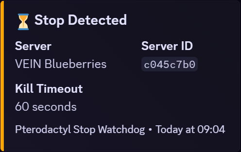
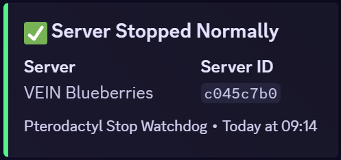
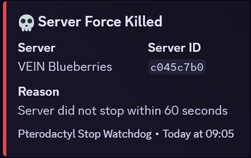

# 🛡 Pterodactyl Stop Watchdog

A small Docker-based watchdog that **automatically force-kills Pterodactyl servers** if they fail to stop gracefully after a configurable timeout.

This is useful for game servers that occasionally hang on shutdown and block restarts, updates, or node reboots.

---

## ✨ Features

- Configurable timeout after pressing **Stop**
- Configurable grace period after **kill** to prevent duplicate notifications
- Automatically sends **KILL** if server is still running
- Optional **Discord webhook alerts**
- Built-in **Docker healthcheck endpoint**
- Caches server names (human-readable logs + alerts)
- Uses official **Pterodactyl Application API**
- Runs as a single lightweight Docker container

---

## ⚠️ Important Notes

- Pterodactyl does **not** have an official plugin system — this runs **externally** using the API
- Requires a **Client API key**
- The container does **not** run inside Wings it runs standalone and uses Pterodactyl's API

---

## 📦 Installation

### Build the Docker Image

```bash
docker build -t pterodactyl-stop-watchdog .
```

Or use a prebuilt image from github or dockerhub.

- github

```bash
docker pull ghcr.io/blackstormlab/pterodactyl-stop-watchdog:latest
```

- dockerhub

```bash
docker pull blackstormlab/pterodactyl-stop-watchdog:latest
```

---

## 🚀 Usage

### Docker Run

```bash
docker run -d \
  --name ptero-watchdog \
  -e PANEL_URL=https://panel.example.com \
  -e CLIENT_KEYS=ptlc_xxx \
  -e SERVERS=abc123,def456 \
  -e KILL_AFTER_SECONDS=60 \
  -e FORCE_KILL_GRACE_SECONDS=5 \
  -e CHECK_INTERVAL=5 \
  -e DISCORD_WEBHOOK_URL=https://discord.com/api/webhooks/... \
  --restart unless-stopped \
  ptero-stop-watchdog
```

---

### Docker Compose (Recommended)

```yaml
services:
  watchdog:
    image: ptero-stop-watchdog
    container_name: ptero-watchdog
    restart: always
    environment:
      PANEL_URL: https://panel.example.com
      CLIENT_KEY: ptlc_xxx
      SERVERS: abc123,def456
      KILL_AFTER_SECONDS: 60
      FORCE_KILL_GRACE_SECONDS: 5
      CHECK_INTERVAL: 5
      DISCORD_WEBHOOK_URL: https://discord.com/api/webhooks/...
```

```bash
docker compose up -d
```

---

## 🔧 Environment Variables

| Variable | Required | Default | Description |
|--------|---------|---------|------------|
| `PANEL_URL` | ✅ | — | Base URL of your Pterodactyl panel |
| `CLIENT_KEY` | ✅ | — | Client API Key |
| `SERVERS` | ✅ | — | Comma-separated list of server UUIDs |
| `KILL_AFTER_SECONDS` | ❌ | `60` | Seconds to wait before force-kill |
| `FORCE_KILL_GRACE_SECONDS` | ❌ | `0` | Seconds to wait after force-kill to start checking again |
| `CHECK_INTERVAL` | ❌ | `5` | Poll interval in seconds |
| `DISCORD_WEBHOOK_URL` | ❌ | — | Discord webhook for alerts |
| `HEALTHCHECK_PORT` | ❌ | `3000` | Healthcheck HTTP port |

---

## 📣 Discord Alerts

When a server is force-killed, a message like this is sent:







---

## ❤️ Healthcheck

The container exposes a simple HTTP endpoint:

```
GET /health
```

- Returns `200 OK` if the watchdog loop is healthy
- Returns `500` if the loop has stalled

Docker uses this automatically via `HEALTHCHECK`.

---

## 🔐 Required API Permissions

The Client API key:

- `example key: ptlc_xxx`

---

## 🪵 Logging

Logs include both **server name and ID**:

```
🛡 Pterodactyl Stop Watchdog started
❤️ Healthcheck listening on :3000/health
[Survival SMP | e8c2c1ab] ⏳ Stop detected, starting 60s timer
[Survival SMP | e8c2c1ab] 💀 Force killing server
[Survival SMP | e8c2c1ab] ⏳ Stop detected, starting 60s timer
[Survival SMP | e8c2c1ab] ✅ Stopped normally
```

---

## 🧠 How It Works

1. Polls server state via the Application API
2. Detects when a server enters `stopping`
3. Starts a timer
4. If the server is still running after the timeout → sends `kill`
5. Cancels the timer if the server stops normally

---

## 🛣 Roadmap / Ideas

- Per-server timeout overrides
- Prometheus `/metrics`
- Node-based auto-discovery
- Optional graceful retry logic
- Multiple webhook targets

---

## 🧾 License

MIT License — do whatever you want, just don’t blame us if a Minecraft server loses its mind 😉

---

## 🤝 Contributing

PRs welcome!

If you have ideas, bugs, or improvements:

- Open an issue
- Submit a pull request
- Or fork it and go wild 🚀
